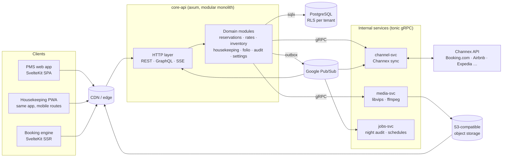
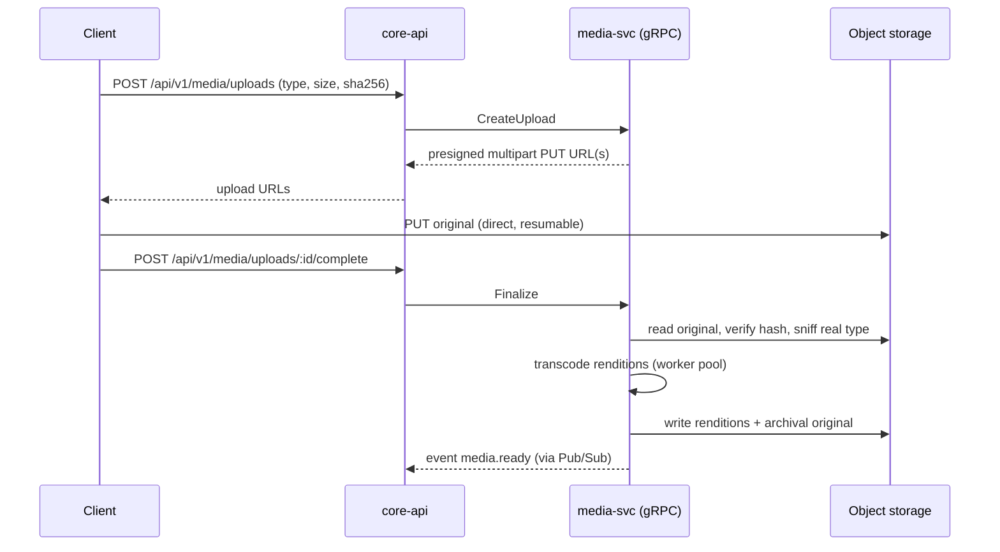

# GoodFolk PMS — Architecture

Status: **v0.6** (2026-09-23). v0.6 records the implementation decisions made while writing the Phase 0 plan: live updates over Postgres `LISTEN/NOTIFY`, SQL checked by integration tests, the `modules/` directory, and the outbox and Pub/Sub moved to Phase 6. Detailed references: [design/data-model.md](design/data-model.md), [design/api-conventions.md](design/api-conventions.md), [specs/](specs/). Decisions marked **[OPEN]** need confirmation before the related phase starts. See [ROADMAP.md](ROADMAP.md) for the delivery plan.

**Target scale (year one):** about 40 tenants, 100 properties, 1,000 rooms in total (roughly 10 rooms per property on average). Primary market: Sri Lanka. English only at launch; multiple currencies from day one.

---

## 1. Goals and non-goals

**Goals**

- A cloud-hosted, multi-tenant hotel PMS. A **tenant** (hotel group or independent owner) runs one or more **properties** from one account.
- Fast for staff: every screen should feel instant. Aim for p95 API latency under 50 ms for reads and under 150 ms for writes (excluding external calls), and interaction-to-next-paint under 100 ms.
- Backend in **Rust + axum** (fixed requirement).
- Pick the protocol per workload: **GraphQL** for data-heavy screens, **REST** for commands and simple CRUD, **gRPC** between internal services.
- A separate media engine that stores photos, video, documents and audio at the smallest size that is visually indistinguishable from the source, and keeps originals losslessly.

**Non-goals for v1**

- Building direct OTA connectivity ourselves (see §9: Booking.com has paused onboarding of new connectivity partners).
- Point-of-sale, spa, or restaurant modules (POS will be designed later; v1 defines only the POS → folio posting contract, §7.5).
- Native mobile apps. Housekeeping ships as an installable PWA.

---

## 2. High-level topology



### Why a modular monolith plus a few services

Hotel operations are highly transactional. A reservation write touches inventory, rates, folio and housekeeping in **one database transaction**. Splitting those into separate services turns local transactions into distributed sagas, which adds latency and many failure modes without adding speed. So:

- **`core-api`** is one axum binary made of strictly separated domain modules (one crate each). Modules call each other through Rust traits, not HTTP. Any module can be extracted later because its boundary already exists.
- **Separate services exist only where the workload is different in kind**, and they talk over **gRPC (tonic)**:
  - `media-svc`: CPU-heavy transcoding. It must not starve the API's tokio workers and scales on its own.
  - `channel-svc`: slow, retry-heavy calls to external systems with their own rate limits.
  - `jobs-svc`: night audit and scheduled work, which is long-running and must be idempotent.

This meets the "gRPC for microservices" requirement without paying the microservice tax on the hot path.

---

## 3. Technology choices

### 3.1 Backend (Rust)

| Concern | Choice | Notes |
|---|---|---|
| HTTP framework | **axum** + tower + tower-http | compression (br/zstd), tracing, timeouts, CORS, request IDs |
| GraphQL | **async-graphql** + `async-graphql-axum` | built-in DataLoader for batching N+1 queries; enforce query depth and complexity limits; persisted queries only in production |
| gRPC | **tonic** + prost | `.proto` files in `/proto`, shared through a `proto` crate |
| DB access | **sqlx** (Postgres) | no ORM overhead, prepared-statement cache. Queries use the `sqlx::query*` functions (checked at run time), and every query is exercised by integration tests against real Postgres, so builds need no database or offline query cache |
| Allocator | **mimalloc** | measurable gains for many small allocations in async servers |
| Serialization | serde / serde_json | JSON for REST and GraphQL, protobuf internally |
| In-process cache | **moka** | rate and room-type metadata, config; invalidated through bus events |
| Messaging | **UI invalidation:** Postgres `LISTEN/NOTIFY` (every API instance listens; delivered only on commit). **Service events (from Phase 6):** transactional outbox → Google Pub/Sub | Pub/Sub pushes events to Cloud Run services, which can then scale to zero. Pub/Sub is behind an `EventBus` trait so it can be swapped out |
| Auth hashing | **argon2id** | |
| Observability | `tracing` + OpenTelemetry → OTLP | structured logs, traces, RED metrics |
| Validation | `validator` / `garde` at the edge | every external input is validated before it reaches domain code |

Release profile: `lto = "fat"`, `codegen-units = 1`, `panic = "abort"`, `opt-level = 3`, built for the deployment CPU (`-C target-cpu=x86-64-v3`, or a Graviton target on ARM).

### 3.2 Frontend: **SvelteKit (Svelte 5, runes) + TypeScript**

Options compared:

| Option | Runtime speed | Bundle | Ecosystem for a data-heavy admin app | Verdict |
|---|---|---|---|---|
| **SvelteKit / Svelte 5** | Top tier. Compiled, no virtual DOM, fine-grained runes | Very small | Mature: TanStack Query and Virtual, headless UI kits, forms, i18n, PWA | **Chosen** |
| SolidJS / SolidStart | Slightly ahead in synthetic benchmarks | Very small | Much smaller ecosystem; SolidStart still changing | Runner-up |
| Leptos (Rust/WASM) | Excellent. Shares types with the backend | 30–80 KB WASM gzipped plus a JS shim | Fewer UI components; every DOM call crosses the JS/WASM boundary; slower build-edit loop | Not for v1 |
| React / Next | Good, but pays virtual-DOM re-render cost | Larger | Largest | Too heavy for the stated priority |

Why SvelteKit: benchmarks put Svelte 5 and Solid within noise of each other for real apps, and both are far ahead of virtual-DOM frameworks. SvelteKit's maturity reduces risk. Leptos is attractive for sharing Rust types, but the tape chart is DOM-heavy, and DOM work is where WASM↔JS glue costs the most. We get most of the type-sharing benefit through code generation (§3.3).

Frontend building blocks:

- **PMS app**: SvelteKit with `adapter-static` in **SPA mode**. It is behind login, so SSR adds nothing. Static assets are served from the CDN with immutable hashes.
- **IBE**: a separate SvelteKit app with **SSR** (SEO, fast first paint for guests), deployed to the edge or a Node/Bun runtime.
- Data: **TanStack Query (Svelte adapter)** for cache, deduplication, cancellation and prefetch. **TanStack Virtual** for large lists and tables.
- Styling: plain CSS with design tokens (custom properties), no runtime CSS-in-JS. Minimal motion, with `prefers-reduced-motion` respected.
- Headless components: **Bits UI** (Svelte 5), for accessible modals, menus and comboboxes.
- i18n: **Paraglide** (translations are compiled in, so unused strings are removed from the bundle). English only at launch, but no hard-coded UI strings, so adding a language is only translation work. Numbers, dates and money are formatted with `Intl`.
- Everything is keyboard-first: front-desk staff use shortcuts all day.

### 3.3 Type sharing (Rust → TypeScript)

- GraphQL: SDL is exported from async-graphql and types are generated with **GraphQL Codegen** (typed document nodes).
- REST: DTOs derive **`utoipa`** OpenAPI, and TS clients are generated with **openapi-typescript**.
- CI fails if the generated files differ from what is committed.

### 3.4 Data and infrastructure: Google Cloud, free tier first

We need a generous free tier until hotels are onboarded, plus an easy way to run several gRPC services. **GCP Cloud Run** fits best:

- It has an always-free allowance, around 180k vCPU-seconds, 360k GB-seconds and 2M requests per month. AWS App Runner has no always-free tier and is in maintenance mode, and Azure Container Apps' cold starts are slower.
- It runs any container, scales to zero, and supports **HTTP/2 end-to-end, so gRPC between services works as-is**. Services call each other with Google-signed service identity tokens, so we don't have to build internal auth.
- Each "microservice" is simply another Cloud Run service built from the same repo. No Kubernetes to operate.

| Concern | Choice | Free tier / later |
|---|---|---|
| Compute | **Cloud Run** services: `core-api`, `media-svc`, `channel-svc`, `jobs-svc` | Free allowance, then pay per use. `core-api` gets `min-instances=1` once hotels are live, to avoid cold starts on the front desk |
| Primary DB | **PostgreSQL 17** on **Neon** (serverless Postgres, scale-to-zero, built-in pooler) | Free: 0.5 GB and 100 CU-hours per month, enough for development and pilots. Move to Neon's paid plan or Cloud SQL at launch. It is plain Postgres, so migrating is a dump and restore |
| Connection pooling | sqlx pool per instance → Neon pooler (transaction mode, which is compatible with `SET LOCAL`) | |
| Object storage | **Cloudflare R2** (S3 API, **zero egress fees**) | 10 GB free. MinIO for local dev |
| Event bus | **Google Pub/Sub** (push subscriptions to Cloud Run) | Large free monthly allowance. The Pub/Sub emulator runs in local dev |
| Scheduling | **Cloud Scheduler** → `jobs-svc` every 15 min; the service works out which properties are due for night audit | 3 jobs free |
| CDN / DNS | **Cloudflare** (static SPA, media renditions, IBE edge cache) | Free plan |
| Secrets | **Secret Manager**, mounted into Cloud Run at runtime. Never in the repo | Small free allowance |
| Region | **Singapore**: Cloud Run `asia-southeast1`, Neon `aws-ap-southeast-1`, Pub/Sub and Secret Manager in `asia-southeast1`, R2 with an Asia-Pacific location hint. The app and the database sit in the same metro area, so database round trips stay short | |
| Build artifacts | Distroless or `scratch` image with a musl static binary; Artifact Registry | |

Cost notes:
- Open SSE connections count as active requests on Cloud Run. Once many front desks are live all day, `core-api` is effectively always on, so expect a small fixed monthly cost at that point. It is still cheap at this scale.
- AV1 video encoding is the heaviest CPU consumer. It runs only in `media-svc`, is triggered by Pub/Sub push, and can be capped with max-instances.

Local dev runs the same containers with `docker compose` (Postgres, MinIO, Pub/Sub emulator), so nothing is tied to GCP for development. Only thin adapters (`EventBus`, object store) touch provider APIs.

---

## 4. Multi-tenancy

### 4.1 Model

```
tenant (hotel group / owner account)
 └── property (a hotel)
      ├── room_type → room
      ├── rate_plan → rate_day
      ├── reservation → reservation_room (stay) → folio
      └── housekeeping, blocks, audit days …
user ── membership(tenant) ── role grants (tenant-wide or per property)
```

### 4.2 Isolation strategy: shared schema + Postgres Row-Level Security

- Every tenant-scoped table has `tenant_id uuid NOT NULL`. Property-scoped tables also have `property_id`.
- RLS is enabled with `FORCE ROW LEVEL SECURITY`. The app connects as a role that is **not** the table owner and does not have `BYPASSRLS`.
- Each request runs in a transaction that begins with `SET LOCAL app.tenant_id = $1`. **Never use plain `SET`**, because pooled connections would leak tenant context into the next request.
- Policies call a `STABLE` SQL function (`app.current_tenant()`) rather than `current_setting()` inline, so the planner can still use indexes. Naive policies are known to cause very large regressions.
- Every composite index **leads with `tenant_id`** (or `property_id`).
- Defense in depth: queries also filter by `property_id` explicitly, and RLS is the safety net.
- An integration test suite tries cross-tenant reads and writes on every table and must see zero rows or an error.
- Escape hatch: large enterprise tenants can later be moved to a dedicated database by pointing their `tenant_id` at a different pool (routing lives in one place).

### 4.3 IDs, time and money

- IDs: **UUIDv7** (time-ordered, index-friendly, no enumeration). Human-facing confirmation numbers are separate short codes, unique per property.
- Time: `timestamptz` for events. **Stay dates are `date` in the property's time zone.** Each property has an IANA time zone and a **business date** that only moves forward at night audit.
- Money: `bigint` minor units **plus an ISO-4217 currency code on every amount**. Never floats. Taxes and rounding rules are configured per property.

### 4.4 Multiple currencies

- Each property has a **base currency** (for example LKR), used for reporting and statistics. It also has a list of **accepted currencies** (for example USD, EUR, GBP, LKR at launch; any ISO-4217 code can be added).
- Each **rate plan has one sell currency**. Non-resident plans are typically in USD and resident plans in LKR (see §7.2).
- An **exchange rate table** per property holds `(date, from, to, rate, source)`. Default source: the **Central Bank of Sri Lanka daily selling rate**. This is the average telegraphic transfer (TT) selling rate quoted by licensed commercial banks at 9:30 a.m. on each working day, published for the main currencies.
  - `jobs-svc` fetches it every working day after publication (Cloud Scheduler, around 10:30 Sri Lanka time). The Central Bank has **no official API**, so the fetcher reads its published rates page behind a `RateSource` trait. If the page layout changes, parsing fails loudly: the admin is alerted and yesterday's rate is **not** reused silently.
  - Weekends and holidays have no new rate, so the last published rate applies and is stored with the date it came from.
  - Staff with the `rates.fx_override` permission can enter a rate by hand for a property and date. Overrides are recorded in the audit log.
- Folio lines keep their **original currency and amount**, plus the base-currency equivalent at the rate for that business date. **Night audit locks the day's rates**, so reports never change after the fact.
- Payments can be in any accepted currency. The folio balance is shown in the folio currency, with the base-currency equivalent next to it.

---

## 5. API design

### 5.1 Protocol per workload

| Surface | Protocol | Examples |
|---|---|---|
| Data-heavy read screens | **GraphQL** (`POST /graphql`) | tape chart tiles, reservation grid, reservation detail, inventory calendar, rate grid, housekeeping board, dashboards |
| Commands / simple CRUD | **REST** (`/api/v1/...`) | create/modify/cancel reservation, check-in/out, assign room, set room status, block dates, upload media, auth, settings |
| Live updates | **SSE** (`GET /api/v1/events?property=`), fed by Postgres `LISTEN/NOTIFY` | "tile X changed", "room 204 now clean"; the client invalidates the matching query cache. The stream opens with a `ready` event so proxies forward headers immediately |
| Service to service | **gRPC** | core-api → media-svc, channel-svc, jobs-svc |
| External webhooks | REST | Channex bookings, payment provider events (signature verified) |

GraphQL is **read-only (queries only)**. All writes go through REST commands. Each write has one clear endpoint with idempotency keys and simple authorization, and GraphQL stays cache-friendly and easy to cost-limit.

SSE instead of GraphQL subscriptions: it is one-directional, works over plain HTTP/2 through every proxy, reconnects on its own, and is cheap on the server. Events carry **invalidation keys, not data**. The client refetches only what is on screen.

### 5.2 Conventions

- REST: JSON, `Idempotency-Key` header required on all POSTs that create things, optimistic concurrency with a `version` column and `If-Match`, RFC 9457 problem+json errors, cursor pagination.
- GraphQL: persisted queries in production (a hash allowlist), depth limit 8, a complexity budget per query, and DataLoaders for every relation.
- Versioning: `/api/v1` for REST. GraphQL evolves through additive changes and deprecation.

---

## 6. Front desk tape chart: viewport-driven loading

This is the most performance-sensitive screen. Requirement: **only load what is on screen**, fetched as the user scrolls horizontally, and keep it smooth.

### 6.1 Data shape

- **Rows**: rooms grouped by room type (plus an "unassigned" lane per type). Room metadata is small (a 300-room hotel is about 15 KB), so it is loaded once, cached and virtualized **vertically**.
- **Columns**: dates, virtualized **horizontally**. The timeline is effectively infinite in both directions.
- **Bars**: reservation stays and room blocks. Only these are fetched on demand.

### 6.2 Tile-based fetching

Fetching the exact pixel viewport would change the query on every scroll frame, and nothing would ever come from cache. Instead the timeline is cut into **fixed, aligned tiles**, similar to how map apps load tiles:

```
tile key = (property_id, tile_start_date, row_block)
tile span = 14 days (aligned to a fixed epoch, so keys are stable)
row_block = 50 rooms (only used for properties with more rooms than fit comfortably; otherwise one block)
```

At the expected scale (about 10 rooms per property on average), a property fits in one row block, so tiles are keyed by date only. Row blocking is kept in the design for large hotels, but it switches on only above 50 rooms.

1. On scroll (throttled with `requestAnimationFrame`), compute which tiles intersect the viewport.
2. Request any missing tiles with **1 tile of overscan** in the scroll direction, so data is ready before it becomes visible. Overscan is configurable; 0 gives strictly on-screen loading.
3. Earlier requests for tiles that have scrolled away are **aborted** (`AbortController` through TanStack Query).
4. Tiles are cached by key with an **LRU cap** (for example about 12 tiles) so memory stays flat however far the user scrolls.
5. A stay crossing tile boundaries shows up in both tiles. The client deduplicates bars by `stay_id`.
6. SSE events include the affected tile keys, and only those tiles are refetched, and only if they are cached.

### 6.3 Minimal payload

The tile query returns just enough to draw bars: `id, room_id, room_type_id, start, end, status, guest_display (short), source, flags (vip/paid/notes bitmask), version`. Everything else (guest profile, folio, notes) is fetched **when a bar is clicked**. Tiles also carry per-day **availability counts per room type** for the header row.

```graphql
query TapeTile($property: ID!, $from: Date!, $to: Date!, $rooms: [ID!]) {
  tapeTile(propertyId: $property, from: $from, to: $to, roomIds: $rooms) {
    stays  { id roomId roomTypeId start end status guest source flags version }
    blocks { id roomId start end reason }
    availability { date roomTypeId free }
  }
}
```

### 6.4 Server side

- `reservation_room.stay` is a `daterange`. There is a **GiST index on `(property_id, stay)`** (with `btree_gist`), and the tile query is one indexed `stay && daterange($from, $to)` scan.
- **Double booking is impossible at the database level**: `EXCLUDE USING gist (room_id WITH =, stay WITH &&) WHERE (status NOT IN ('cancelled','no_show'))`.
- Target: under 10 ms server time per tile, and a compressed payload of a few KB.

### 6.5 Rendering

- One scroll container. A CSS grid draws the background (day lines and weekend shading) with `background-image` gradients, so there are **no per-cell DOM nodes**.
- Only bars inside the virtual window are DOM elements, absolutely positioned with `transform: translate()`.
- Drag to move or extend a stay uses pointer events, updates optimistically, then sends a REST command. If the command conflicts (version or exclusion violation), the bar snaps back with a message.
- Sticky room rail and sticky date header use `position: sticky`, with no JavaScript scroll syncing.
- Fallback: if profiling shows DOM limits on very large properties, the grid layer can switch to `<canvas>` while bars stay in the DOM for accessibility.

---

## 7. Domain modules

### 7.1 Reservations

- Hierarchy: `reservation` (booker, source, channel, confirmation #, guarantee) → one or more `reservation_room` (room type, optional assigned room, stay range, occupancy, rate plan, meal plan) → `folio`.
- Reservation grid (GraphQL): server-side filtering, sorting and cursor pagination. It renders with TanStack Virtual and keeps a fixed number of DOM rows.
- Clicking a row opens a **large modal** whose URL is `/reservations/:id` (deep-linkable, and the browser back button closes it). Detail data is prefetched on row hover or keyboard focus, so the modal usually opens with data already loaded.
- New reservation: availability search → pick room type, rate and meal plan → guest → guarantee or payment. It is a single REST `POST` with an idempotency key. The server re-validates availability and price inside the transaction.
- Statuses: `tentative → confirmed → checked_in → checked_out`, plus `cancelled` and `no_show`. Transitions are enforced by a state machine in the `domain` crate.

### 7.2 Rooms and rates

**Room types**: name, code, capacity (base, max adults and children), bed configuration, amenities, media. They can be imported from a channel mapping (see §9).

**Rate plans** have three kinds:

| Kind | Meaning |
|---|---|
| **Standard (parent)** | Prices set directly per room type, per date, per occupancy |
| **Derived** | Price = parent price ± percent or fixed amount, with a rounding rule. Options to inherit restrictions (min/max stay, CTA/CTD, stop-sell), and a derivation chain depth limit of 3 |
| **Custom** | Standalone, set directly, not linked to anything |

**Segment / distribution tags** on rate plans: `FIT-F`, `FIT-L`, `OTA`, `TA`, `IBE`. Each controls where the plan is sold (IBE, channel manager, TA contracts). Any of them can be standard or derived. For example, "OTA = BAR +15%" and "IBE = BAR −5%".

**FIT-F / FIT-L (residency):**

| Tag | Guest | Typical currency | Rule |
|---|---|---|---|
| `FIT-F` | Foreign (**non-resident**) | USD (or another foreign currency) | Only sellable to guests whose residency is non-resident |
| `FIT-L` | Local (**resident**) | LKR | Only sellable to residents |

- Every guest profile has a **residency** field (resident / non-resident) and a country of residence. The IBE asks for residency before showing prices and only shows the matching plans. Front-desk staff see a warning if they apply a plan that doesn't match the guest's residency.
- **Resident prices are set by hand.** Derived plans must use the **same currency as their parent**, and the system rejects derivation across currencies. FIT-L plans are usually standalone LKR plans, or derived from another LKR plan. Exchange rates are used only for folio conversion and reporting, never to create prices.
- Compliance with Central Bank rules: licensed hotels must accept payment from **non-residents in foreign currency**, unless there is documentary evidence that the rupees were converted through a licensed bank. The folio therefore **flags an LKR payment on a non-resident's folio** and asks for the evidence reference (the reference number and an uploaded document).

**Meal plans**: `RO` (room only), `BB` (bed and breakfast), `HB` (half board), `FB` (full board). Modeled as a **per-person-per-night supplement** (adult and child prices) on top of the room price, so one parent rate can be sold in every meal plan without copying price grids. A rate plan lists which meal plans it allows. A property can instead choose to price meal-inclusive plans directly (as a derived plan with a fixed offset).

**Price resolution and storage**

- `rate_day(rate_plan_id, room_type_id, date, occupancy, amount, restrictions…)` stores **resolved** prices for every plan, derived ones included.
- When a parent price changes, the derived rows are recomputed **inside the same transaction** (bounded: a handful of plans × dates changed). Reads (rate grid, IBE search, channel push) never compute derivations at query time. They are plain indexed range scans.
- Bulk edits (for example "+10% for all of July") are one REST command that updates the parent rows and their descendants set-based in SQL.

### 7.3 Inventory

- `inventory_day(property_id, room_type_id, date, physical, sold, out_of_order)` keeps a counter row per room type per day, from the business date for 730 days, updated in the same transaction as the room, reservation or block. Availability reads are then O(days), with no counting over reservations.
- Correctness guard: a nightly job recomputes counters from the source tables and alerts on drift.
- **Room blocks**: `room_block(room_id, range, reason, kind, note)` with `kind = out_of_order` (removed from inventory, for renovation or construction) or `out_of_service` (still sellable, but flagged). Reason codes are configurable per property. Blocks show on the tape chart and reduce availability. They cannot overlap existing stays unless the overlapping stays are moved first; the server returns the list of conflicts.
- Inventory calendar screen (GraphQL): room types × dates grid showing free/sold/blocked, plus restrictions, windowed by month.

### 7.4 Housekeeping

- Room status has two dimensions:
  - **Occupancy**: vacant / occupied / due out / due in (derived from reservations).
  - **Condition**: `dirty → cleaning → clean → inspected`, plus `out_of_order` / `out_of_service` (from blocks).
- Check-in is only allowed into `clean` or `inspected` rooms (configurable). Check-out automatically sets the room to `dirty`.
- Housekeeping board (GraphQL) with filters by floor, section, housekeeper and status. The PWA view for housekeepers shows only **their assigned rooms**, big touch targets, and works offline (a queue replays when the connection returns).
- **Issue reports**: room, category, severity, description, photos (via media-svc), status (`open → in_progress → resolved`), and assignee (maintenance). A high-severity issue can automatically suggest an out-of-order block.
- **Laundry** has two parts:
  - **Hotel linen**: item types (sheets, pillowcases, towels…), par levels per room type, stock by location (store, floor pantry, in laundry), and batches sent to and received from a laundry (in-house or vendor) with counts. Differences between sent and received counts are logged, and damaged or discarded items are written off. A low-stock alert fires when a location drops below par.
  - **Guest laundry service**: a price list per item and service (wash, press, dry clean, express). Order status runs `collected → processing → ready → delivered`, tied to the guest's stay and room. **Charges are posted to the guest folio when the order is delivered**, and appear at night audit like any other charge.

### 7.5 Folio and night audit

The night audit needs folios, so a **folio** is in v1 scope: charges, payments, taxes, routing to a company or guest, and multiple currencies (§4.4).

**Charge sources.** Every folio line records where it came from: `room`, `meal_plan`, `laundry`, `pos`, `manual`, `no_show_fee`, `adjustment`. The **POS system will be designed later**. For now we define the contract it will use:
- A `PostPosBill` gRPC call (and a matching REST endpoint for third-party POS systems). Fields: outlet, bill number, items, taxes, currency, and the target (a room/folio, or "non-resident walk-in" when the bill is settled directly).
- Idempotent on `(outlet, bill number)`. POS bills settled directly with no room are still recorded, so the audit covers all revenue.

**Night audit** runs per property, either started by a user or scheduled at the property's audit time. It is a **guided review screen**, followed by a checkpointed close:

1. **Expected arrivals not checked in**: every reservation due to arrive on the business date that is still not checked in. For each one, staff choose **mark as no-show** (the default action, posting a no-show fee if the policy says so), **extend to tomorrow**, or **cancel**. The audit cannot close until every arrival is resolved.
2. **Departures not checked out**: check out or extend.
3. **POS bills** for the day: every bill from every outlet, grouped by outlet, showing which were posted to rooms and which were settled directly, and highlighting any bill still open.
4. **Booking bills**: room and meal-plan charges about to be posted for every in-house stay (a preview), plus the day's laundry and manual charges.
5. **Payments**: every payment taken that day by method (cash, card per provider, bank transfer, city ledger) and by currency, with base-currency totals, for the cashier to reconcile. Non-resident LKR payments without documentary evidence are flagged.
6. **Close** (in `jobs-svc` over gRPC, one checkpointed and idempotent run):
   1. Post room, tax and meal-plan charges for the business date.
   2. Lock the day's exchange rates.
   3. Snapshot statistics: occupancy, ADR, RevPAR, revenue by segment, source and outlet, room nights, and resident vs non-resident mix.
   4. Generate PDF reports (stored through media-svc) and **advance the business date**.

Each close step is recorded in an `audit_run` table with step states, so a crash resumes instead of double-posting. Postings are write-once. Corrections are reversals, never edits.

### 7.6 Taxes and service charge (Sri Lanka)

Researched September 2026 from primary sources where they exist (IRD, SLTDA) and secondary sources where they don't. Each fact below is marked **Confirmed** (primary source) or **Reported** (secondary source only).

#### 7.6.1 What each charge is

| Charge | Rate | Calculated on | Who it applies to | Status |
|---|---|---|---|---|
| **Service charge (SC)** | Usually **10%**, set by the hotel | Net amount | The hotel's choice, per category or outlet (restaurant and bar bills at minimum; many hotels also charge it on rooms) | A commercial charge, not a tax. Tax rules treat it specially (TDL excludes it) |
| **TDL** (Tourism Development Levy) | **1%**, or **0.5%** if annual turnover ≤ LKR 12M (quarterly ≤ LKR 3M) | Hotel turnover **excluding service charge (up to 10%) and VAT** | SLTDA-licensed tourist hotels. Paid **quarterly to SLTDA** | **Confirmed** (SLTDA) |
| **SSCL** (Social Security Contribution Levy) | **2.5%** of liable turnover. Hotels are "other services", so **100% of turnover** is liable | Turnover **excluding VAT** (and bad debts) | Businesses above the threshold: LKR 9M per quarter or LKR 36M per 12 months from 1 July 2026 (previously 15M / 60M). Monthly payment, quarterly return | Rate and base **Confirmed** (IRD). New threshold **Reported** |
| **VAT** | **18%** standard rate (since 1 Jan 2024). Hotels and restaurants are at the standard rate; the 2019–2022 concessions have ended | Value of supply (includes service charge) | Only **VAT-registered** properties: LKR 15M per quarter or LKR 60M per 12 months. The planned lower threshold was **abandoned** in July 2026 | **Confirmed** (IRD notice SEC/PN/VAT/2026-03) |

**Key points:**
- **TDL and SSCL are levies on the hotel's turnover, not taxes the law makes the guest pay.** A hotel either **passes them on** as bill lines (common in Sri Lanka) or **absorbs them** into its prices. The PMS must compute them either way, because the hotel owes them either way.
- **Which charges apply depends on the property.** A small guest house under the VAT threshold charges no VAT. A hotel under LKR 12M a year pays TDL at 0.5%. So registration status and the turnover band are **property settings**, not constants.
- **Possible SSCL exemption (Reported):** secondary sources list an exemption for "services provided to persons outside Sri Lanka, paid in foreign currency and remitted through a bank". Whether it covers **hotel stays**, where the guest is physically in Sri Lanka, is doubtful and **needs an accountant's ruling**. It may cover foreign tour operators and travel agents billed in USD. The engine supports it as a conditional exemption.

#### 7.6.2 What is still unclear: the order the charges are applied in

No official source spells out the full stack for a hotel bill, meaning whether VAT is charged on top of TDL and SSCL when those are passed on. Two approaches exist in practice:

| | **A: "cascade"** (VAT on everything passed on) | **B: "flat"** (every levy on net + SC) |
|---|---|---|
| Net (restaurant bill) | 10,000.00 | 10,000.00 |
| + Service charge 10% (on net) | 1,000.00 | 1,000.00 |
| + TDL 1% (on net, excluding SC as SLTDA requires) | 100.00 | 100.00 |
| + SSCL 2.5% (on net + SC + TDL) | 277.50 | (on net + SC) 275.00 |
| + VAT 18% (on net + SC + TDL + SSCL) | 2,047.95 | (on net + SC) 1,980.00 |
| **Total** | **13,425.45** | **13,355.00** |

The difference is about 0.5% of the bill, but **tax invoices must be exact**.

**Decision: order A (cascade) is the platform default.** Amounts passed on to the guest are part of the consideration, and therefore of the VAT value of supply. The engine still supports any order, so a property whose accountant rules otherwise changes settings, not code.

#### 7.6.3 How the engine works

Taxes are data, not code:

```
tax_rule(property_id, code, name, kind: tax | levy | service_charge,
         rate_bp,                                  -- 1000 = 10%
         applies_to: [charge categories],          -- room, meal_plan, laundry, pos:<outlet>, …
         base: [components included in the base], -- e.g. VAT base = [net, SC, TDL, SSCL]
         sequence,
         presentation: on_bill | absorbed,         -- absorbed = calculated and reported, not shown to the guest
         condition: always | vat_registered | residency(...) | payment_currency(...),
         effective_from, effective_to)
```

- Calculated **per folio line at posting time** and stored with the line. Past bills never change. Budget changes become new effective-dated rows.
- **Inclusive prices** (for example OTA rates that include tax) are worked backwards through the same rule stack, so net + components add up exactly to the inclusive amount.
- Rounding is in minor units per component, and the rounding remainder goes to the net amount, so the total always matches.
- **Service charge per category and per outlet**, with its own revenue account, ready for staff service-charge distribution reports later.
- **Liability reports**: TDL per quarter (in SLTDA's format), SSCL per month and quarter, VAT per return period, and service charge collected. Each also includes the absorbed amounts.

**Sri Lanka preset** (applied when a property is created, then editable): SC 10% on `pos:*` (restaurant and bar outlets); rooms optional, off by default. TDL 1% (0.5% when the property's turnover band is set to small). SSCL 2.5%. VAT 18% only if the property is VAT-registered. Order A. Everything shown on the bill.

#### 7.6.4 Tax invoice rules that affect the design

- **New standard VAT tax invoice format.** It was mandated for 1 April 2026, then **Reported** as deferred to **1 October 2026**. Requirements:
  - the heading "TAX INVOICE";
  - supplier TIN, and purchaser TIN where applicable;
  - the new serial number format;
  - invoice and supply dates;
  - VAT rate;
  - **values in LKR with no cents**;
  - the total in words;
  - the payment method.

  A USD folio therefore needs its **tax invoice in LKR**, converted at the day's locked rate (§4.4), with the USD amounts shown for reference. Invoice numbers use a gapless series per property, allocated inside the posting transaction. The final layout needs the IRD specification before Phase 7.
- **Secured POS machines** (VAT Amendment Act No. 14 of 2026, **Confirmed**): VAT-registered businesses must use secured POS machines for transactions and invoices within three months of the specifications being published. The specifications are **not published yet**. This affects the future POS module and possibly PMS invoicing, so we will track it.
- **RAMIS web API** (**Confirmed**): IRD accepts VAT schedule data through CSV upload or a real-time web API from the taxpayer's system. This is a later integration: invoices would be pushed from the PMS automatically.

#### 7.6.5 Sources

- IRD, *Notice to Taxpayers SEC/PN/VAT/2026-03* (3 July 2026): VAT Amendment Act No. 14 of 2026, thresholds, secured POS, RAMIS. https://www.ird.gov.lk/en/Lists/Latest%20News%20%20Notices/Attachments/799/PN_VAT_2026-03_New_E.pdf
- IRD, SSCL. https://www.ird.gov.lk/en/Type%20of%20Taxes/SitePages/Social%20Security%20Contribution%20Levy%20(SSCL).aspx
- SLTDA, Tourism Development Levy. https://www.sltda.gov.lk/en/tourism-development-levy
- KPMG, Sri Lanka VAT to 18% from 1 Jan 2024. https://kpmg.com/us/en/home/insights/2023/11/tnf-sri-lanka-cabinet-approval-to-increase-vat-rate-to-18-percent-effective-1-january-2024.html
- Bizadvisor, SSCL guide (liable turnover by sector, thresholds). https://bizadvisor.lk/handbook/social-security-contribution-levy-sri-lanka
- Taxable.lk, SSCL amendment 2026. https://taxable.lk/blog/sscl-amendment-2026-sri-lanka
- Lanka Tax Club, SSCL exemptions. https://lankataxclub.lk/social-security-contribution-levy-sscl/
- VATupdate, standardized VAT tax invoice format. https://www.vatupdate.com/2026/03/30/sri-lanka-mandates-new-standardized-vat-tax-invoice-format-effective-april-1-2026/

### 7.7 Settings

Tenant: users, roles, properties, billing. Property: time zone, currency, taxes, check-in and check-out times, audit time, policies (cancellation, deposit), reason codes, housekeeping sections, channel connections, IBE branding.

**Roles and permissions**: RBAC with permission strings (`reservations.write`, `rates.edit`, `audit.run` …). Grants apply tenant-wide or per property. The API checks them in axum middleware and extractors, and the UI hides what the user cannot do.

---

## 8. Media engine (`media-svc`)

Goal: store any upload at the **smallest size with no visible quality loss**, and **keep the original bit-exact** so nothing is ever lost permanently.

### 8.1 Flow



- Uploads go **directly to object storage** through presigned URLs. Large files never pass through the API.
- Deduplication by content address: **BLAKE3** hash of the original, so the same photo used in 5 properties is stored once.
- Real type detection comes from magic bytes, not the file extension. There is a per-tenant allowlist and size limits, and EXIF GPS is stripped from public renditions.
- Encoding is CPU-bound and runs in a bounded worker pool (`spawn_blocking` / a dedicated rayon pool) in a separately scaled deployment.

### 8.2 Formats (researched Sept 2026)

| Media | Archival original (lossless) | Delivery renditions | Why |
|---|---|---|---|
| **Photos** | JPEG sources → **JPEG XL lossless JPEG transcode** (about 20% smaller, bit-exact reversible to the original JPEG). PNG/TIFF/HEIC → JPEG XL lossless | **AVIF** (primary, about 93% browser support) + **WebP** fallback, at responsive widths (320/640/1024/1600/2400) | AVIF gives the best delivered size with universal-enough support. JXL is ideal for lossless archiving but is still behind a flag in Chrome, so it is not served to browsers |
| **Video** | Original kept as uploaded | **AV1 (SVT-AV1, 10-bit, preset ~5–6, CRF ~28–30)** in **CMAF / HLS**, plus **H.264** fallback rendition; audio **Opus** (AV1) / AAC (H.264) | AV1 is about 30–50% smaller than H.264 at the same quality, with hardware decode now common. CMAF uses one set of segments for HLS and DASH |
| **Audio** | Lossless sources → **FLAC**; lossy sources kept as-is | **Opus** 96–128 kbps | Opus is the most efficient general-purpose codec |
| **Documents** | PDFs stored as-is (optionally linearized); other files **zstd**-compressed | First-page thumbnail (AVIF) | Compressing already-compressed PDFs gains little |

Tooling: **libvips** (fast, low memory) for images, with libjxl / libavif; **ffmpeg** with SVT-AV1 / libopus for AV and audio. They are called from Rust through bindings or supervised subprocesses.

"No quality loss" means: renditions are **visually lossless** at the chosen settings (checked with SSIMULACRA2 / VMAF thresholds in CI against a sample set), and the **archival original is mathematically lossless**. Re-encoding at better settings later is always possible from the archive.

Delivery: renditions sit behind the CDN with immutable keys. Private media (IDs, invoices, guest documents) use **short-lived signed URLs** and are never cached publicly.

---

## 9. Channels and imports (Booking.com, Airbnb …)

- **Booking.com has paused onboarding of new connectivity providers**, and Airbnb's API is invite-only. Direct integration is not realistic in the short term.
- Plan: integrate a **white-label channel manager API: Channex** (a single REST API to Booking.com, Airbnb, Expedia and 50+ OTAs, with bookings delivered by webhook). `channel-svc` owns this integration.
  - **Room type import**: when a property connects a channel, read the channel's room and rate mapping through Channex and offer to **create or match** local room types from it.
  - **ARI push**: availability, rates and restriction changes are emitted as events from the outbox, then debounced and batched per property by `channel-svc`, and pushed.
  - **Booking pull**: Channex webhook → verify signature → idempotent upsert of the reservation → acknowledge.
- `channel-svc` sits behind a `ChannelProvider` trait, so a direct connection can be added later without touching core.
- **Decision:** Channex is confirmed as the channel manager. OTA plans are usually sold in USD; `channel-svc` pushes each plan in its own currency, and mapping a plan to a channel checks that the currencies match.

---

## 10. Internet Booking Engine (IBE) — to be designed

The architecture reserves room for it; the detailed design waits on your input:

- A separate SvelteKit **SSR** app per tenant or property, on a custom domain or subdomain, with branding from settings.
- Public read endpoints (availability and price search) are served from `rate_day` + `inventory_day`, with a short edge cache (about 30 s) keyed by property, dates and occupancy. They are anonymous and rate-limited.
- Booking goes through the same REST reservation command with a hold-then-confirm flow and payment tokenization.
- Payments: see §10.1. **We never store card numbers**, only processor tokens.

### 10.1 Payments

How money is taken:

| Situation | Method | Integration |
|---|---|---|
| At the hotel (any guest, any currency) | **The hotel's own card terminal** (bank POS machine) | **No integration.** Staff record the payment on the folio: amount, currency, terminal/bank, approval code, card brand and last 4 digits. It appears in the night audit payments review for reconciliation against the terminal's settlement report |
| Online (IBE, pre-arrival deposits, card guarantees, payment links) in **LKR or foreign currency** | The **hotel's bank internet payment gateway**: **CyberSource** (primary) | Full integration (below) |
| Same, for hotels whose bank uses Mastercard Gateway | **Mastercard Payment Gateway Services (MPGS)** | Full integration (below) |
| Resident / LKR online, for small properties without a bank gateway | **payments.lk** | Optional, full integration |
| OTA virtual cards / OTA-collected payments | Channex / the OTA | Handled by the channel |
| Cash, bank transfer, city ledger | Manual folio payment | |

#### Which gateway each major bank offers (researched September 2026)

| Bank | CyberSource | Mastercard Gateway (MPGS) | Source |
|---|---|---|---|
| **Commercial Bank** | ✅ | ✅ (offers both) | ComBank |
| **HNB** | ✅ (first CyberSource reseller in Sri Lanka) | — | HNB |
| **Sampath Bank** | ✅ | — | Sampath |
| **Bank of Ceylon** | — | ✅ | BOC |
| **People's Bank** | — | ✅ | Daily Mirror |
| **Seylan Bank** | — | ✅ | Seylan |
| **Nations Trust Bank** (Amex acquiring) | — | ✅ | Daily FT |
| **NDB, DFCC, Pan Asia** | not found publicly | not found publicly | Confirm with each bank |

**Decision: support both gateways.** CyberSource covers ComBank, HNB and Sampath. The **Mastercard Gateway (MPGS)** covers BOC, People's Bank, Seylan, NTB and ComBank. Each hotel uses whichever gateway its own bank provides, and both are implementations of the same `PaymentProvider` trait.

#### CyberSource integration

- Card capture with **Unified Checkout** (or Microform hosted fields for an inline form). Card data goes directly to CyberSource and we receive a transient token, which keeps us at the lowest PCI scope (SAQ A).
- **Token Management Service (TMS)** turns that into a reusable customer token, used for guarantees, no-show fees and later charges. We store only the token.
- **Authorization at booking, capture at check-out or on the deposit date**, with 3-D Secure. Refunds and voids go through the Payments API.
- **LKR and foreign currency** through the same integration. The charge currency is the rate plan's currency. Which currencies a hotel can accept, and where foreign currency settles (a business foreign-currency account, as the Central Bank requires for non-residents), depends on the bank's merchant setup. This is covered in each bank's guide.
- API authentication uses **JWT with the merchant's key**. The older HTTP Signature method is being retired (migration deadline September 2026), so we do not implement it.
- Webhooks are encrypted with our public key, which is uploaded to CyberSource's key management. They are verified and decrypted, then the payment is upserted idempotently onto the folio.

#### Mastercard Gateway (MPGS) integration

- **Hosted Checkout**: our server calls *Initiate Checkout*, which returns a `session.id`. The page opens the gateway's payment page (redirect or embedded) through `Checkout.configure()`. Card data goes directly to the gateway, so we stay at the lowest PCI scope (SAQ A).
- **Tokenization**: the card is saved as a gateway token, used for guarantees, no-show fees and later charges. We store only the token.
- **Authorize at booking, capture at check-out or on the deposit date**, with 3-D Secure (the gateway's Authentication API). Refunds and voids use the same API. Charges are in LKR or foreign currency, as the bank's merchant setup allows.
- Authentication: HTTP Basic with `merchant.<merchant ID>` and the merchant's **API password**. Certificate authentication is supported later if a bank requires it.
- **The gateway host differs per bank or region** (for example the Asia-Pacific host, or a bank-branded host), so the **base URL is a per-property setting**, never hard-coded.
- **Webhooks**: the gateway sends the merchant's secret in the `X-Notification-Secret` header. We compare it in constant time, then **retrieve the order from the gateway API** to confirm its status before updating the folio. The payload alone is never trusted. The update is idempotent on the order and transaction ID.
- The REST API is versioned in the URL. We pin one version and upgrade on purpose.

#### Hotel setup guides (`docs/guides/payments/`)

- `cybersource.md`: the common technical steps. Enable Unified Checkout, TMS and 3-D Secure in the Business Center, create the REST (JWT) key, upload our webhook public key, and enter credentials in Settings → Payments. It ends with a sandbox test transaction before going live.
- `mpgs.md`: the same for the Mastercard Gateway. Enable Hosted Checkout, tokenization and 3-D Secure in Merchant Administration, create the API password, set the webhook URL and notification secret, and enter the gateway host, merchant ID and credentials in Settings → Payments. It ends with a test-merchant transaction before going live.
- **One page per bank**: `combank.md`, `hnb.md`, `sampath.md`, `boc.md`, `peoples.md`, `seylan.md`, `ntb.md`, plus `ndb.md` and `dfcc.md` once their platform is confirmed. Each covers:
  - which platform the bank uses and how to apply;
  - required documents: business registration, SLTDA licence, and so on;
  - fees as published;
  - supported currencies and settlement into a business foreign-currency account;
  - who to contact;
  - a link to the common technical guide for the platform.
- Bank-specific details (forms, fees, contacts) change and are not all public. **Each bank page will be written from the bank's current merchant documentation and checked with the bank's merchant team before we give it to hotels. Nothing will be guessed.** They are written in Phase 7, alongside the integration they describe.

#### payments.lk (Payable): optional, LKR only

- A REST API (bearer secret key, OpenAPI 3.1 spec) with a sandbox, hosted checkout with 3-D Secure, saved-card tokens and charge-later (`POST /v1/cards/:id/charge`), refunds, payment links, idempotency keys, and signed webhooks.
- No monthly fee: 2.29% up to Rs. 100k/month, 2.49% above, +1% for foreign cards. Useful for small properties that don't want a bank gateway.
- **LKR only**, so it cannot take non-resident payments (Central Bank rule). The PMS blocks routing a non-resident payment to it.

#### Common design

- Every provider implements one `PaymentProvider` trait: `create_checkout`, `authorize`, `capture`, `charge_saved_card`, `refund`, `verify_webhook`. Terminal and cash payments are a `manual` provider, so every payment type goes through one folio path.
- **Each property stores its own merchant credentials**, encrypted and kept in Secret Manager, because each hotel is its own merchant of record. Routing rules per property choose the provider by channel (online or at the desk), currency and guest residency.
- Webhooks from every provider go to one ingestion endpoint. Signatures are verified, then the payment is upserted idempotently onto the folio.

---

## 11. Security

- Auth: email + password (argon2id) with optional TOTP; SSO (OIDC) for enterprise tenants later. Sessions are **opaque tokens in `HttpOnly; Secure; SameSite=Lax` cookies**, stored hashed server-side and revocable. No long-lived JWTs in the browser.
- CSRF: SameSite cookies plus a custom-header requirement on state-changing requests.
- Authorization: tenant from the session → `SET LOCAL` → RLS. Property permission is checked in the extractor. The UI never decides authorization.
- Input validation at every edge. GraphQL cost limits. Per-tenant and per-IP rate limits.
- PII: encryption at rest (managed DB and storage), field-level encryption for ID or passport numbers, audit log of access to guest documents, and GDPR export and erase per guest.
- Append-only **audit log** for sensitive actions (rate changes, folio adjustments, overrides, permission changes).
- Dependency scanning (`cargo audit`, `cargo deny`, `pnpm audit`) in CI.

---

## 12. Repository layout (proposed)

```
GoodFolk/
├── Cargo.toml                # workspace: members crates/* and modules/*
├── crates/                   # services and shared infrastructure
│   ├── core-api/             # axum binary: REST, GraphQL, SSE, auth, migrate command
│   ├── db/                   # pool, migrations, tenant-scoped transactions, change events
│   ├── domain/               # pure business rules: state machines, pricing math (from Phase 3)
│   ├── proto/                # tonic-prost-build code from /proto (Phase 6)
│   ├── media-svc/            # gRPC server + transcoding workers (Phase 6)
│   ├── jobs-svc/             # night audit + scheduled jobs (Phase 7)
│   └── channel-svc/          # Channex integration (Phase 8)
├── modules/                  # one crate per business domain: identity, property, rooms, rates,
│                             # reservations, housekeeping, folio, tax, payments, …
├── proto/                    # .proto contracts (Phase 6)
├── migrations/               # SQL migrations (Postgres), applied by `core-api migrate`
├── web/
│   ├── pms/                  # SvelteKit SPA (includes housekeeping PWA routes)
│   └── ibe/                  # SvelteKit SSR booking engine (Phase 9)
├── deploy/                   # local dev support (Postgres roles), Cloud Run definitions / IaC
└── docs/                     # architecture, roadmap, design references, phase specs and plans
```

---

## 13. Decisions log

| # | Topic | Decision |
|---|---|---|
| 1 | FIT-F / FIT-L | Non-resident / resident plans, mainly split by currency (§7.2) |
| 2 | Laundry | Both hotel linen and guest laundry service (§7.4) |
| 3 | Channel manager | Channex (§9) |
| 4 | Night audit | Guided review of arrivals/no-shows, departures, POS bills, booking bills and payments, then a checkpointed close (§7.5). POS itself will be designed later; the posting contract is defined now |
| 5 | Hosting | Free tier first on GCP: Cloud Run + Neon + R2 + Pub/Sub + Cloudflare, all in **Singapore** (§3.4) |
| 6 | Language / currency | English at launch, ready for more languages; multiple currencies (§4.4) |
| 7 | Payments | At the hotel: card terminal, recorded manually. Online: CyberSource **or** Mastercard Gateway (MPGS), whichever the hotel's bank provides, for LKR and foreign currency. payments.lk optional (LKR only). Setup guides for every major bank (§10.1) |
| 8 | Scale | About 40 tenants, 100 properties, 1,000 rooms |
| 9 | Resident pricing | Set by hand; no derivation across currencies (§7.2) |
| 10 | Exchange rates | Central Bank of Sri Lanka daily TT selling rate, fetched automatically, with a manual override (§4.4) |
| 11 | Taxes | Service charge, TDL, SSCL and VAT through an effective-dated, ordered rules engine, with a researched Sri Lanka preset. **Order A (cascade)** (§7.6.2) |

## 14. Open questions

Worth confirming with an accountant before Phase 7. None of these change the design; each is a settings value:
- whether the SSCL foreign-currency exemption applies to hotel stays;
- whether hotels normally show TDL and SSCL on the bill or absorb them into prices;
- the final layout of the IRD tax invoice, once IRD publishes the specification.
